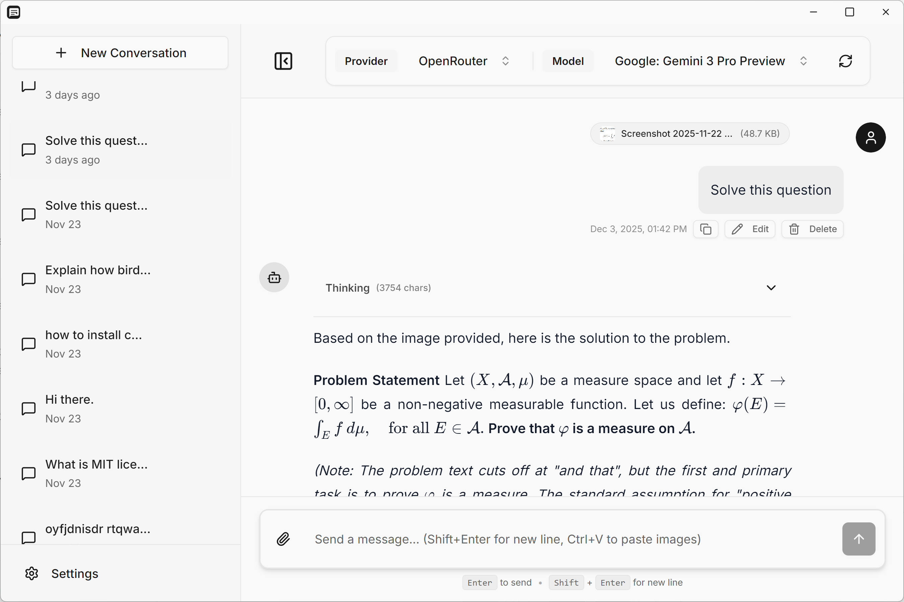

# ChatAnyLLM

A desktop chat application for interacting with multiple AI language models through a unified interface.

**[Visit Website](https://jinyang6.github.io/chatanyllm/)**

  

## Features

- **Multiple AI Providers** - OpenRouter (recommended), OpenAI, Anthropic Claude, Google Gemini, and custom endpoints
- **Local & Secure** - All conversations stored locally, API keys encrypted with Windows DPAPI
- **Rich Formatting** - Markdown, code syntax highlighting, LaTeX math equations
- **Image Support** - Paste and preview images in conversations
- **Custom Providers** - Add any OpenAI-compatible API endpoint

## Installation

### Download
Download the latest installer from [Releases](../../releases) or visit our [website](https://jinyang6.github.io/chatanyllm/):
- **Windows**: `ChatAnyLLM-Setup.exe`

### Install
1. Run the installer
2. Choose installation directory
3. Launch ChatAnyLLM

## Quick Start

1. **Add API Key** - Settings → API Keys → Enter your provider's API key
2. **New Conversation** - Click + button in sidebar
3. **Select Model** - Choose your AI model from dropdown
4. **Start Chatting** - Type message and press Enter

## Keyboard Shortcuts

- `Enter` - Send message
- `Shift+Enter` - New line
- `Ctrl+V` - Paste image

## Technology Stack

Electron • React • Vite • Tailwind CSS

## License

MIT License - See [LICENSE](LICENSE) file for details

## Support

Found a bug or have a suggestion? [Open an issue](../../issues)
